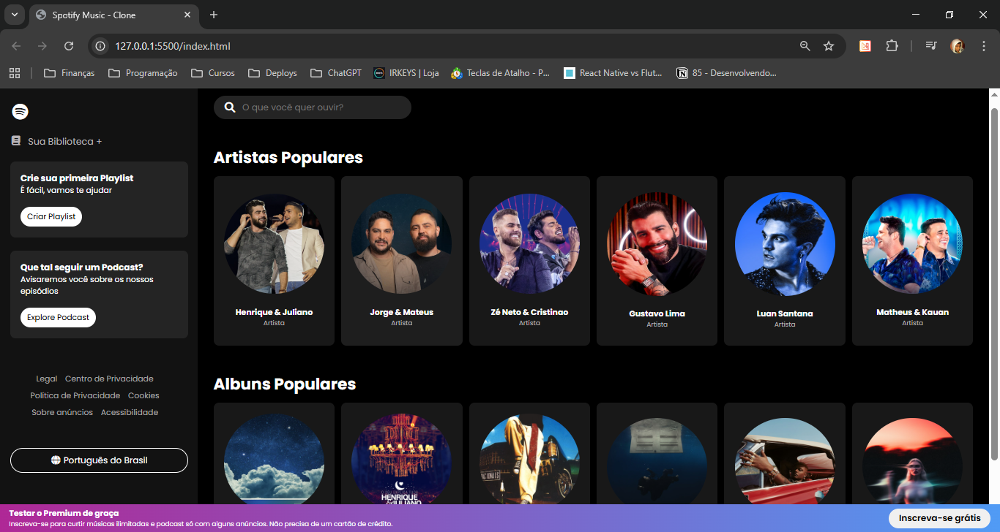

# 🎵 Spotify Music - Clone

Um projeto front-end inspirado na interface do **Spotify**, recriando a experiência de navegação com sidebar, barra de pesquisa, cards de artistas e álbuns populares.

---

## 🔹 Tecnologias utilizadas
- **HTML5** – Estrutura da página  
- **CSS3** – Estilização e design responsivo  
- **JavaScript** – Manipulação do DOM e inserção dinâmica dos dados  
- **Font Awesome** – Ícones visuais  
- **Google Fonts** – Tipografia moderna  

---

## ✨ Funcionalidades
- Sidebar com **biblioteca**, **playlists** e **podcasts**.
- Área principal com **barra de pesquisa**.  
- Exibição de **artistas populares** e **álbuns populares** via JavaScript. 
- Layout, inspirado no **Spotify oficial**.
- Banner fixo inferior incentivando assinatura premium .

---

## 🖼️ Prévia do projeto

  

---

## 📸 Demonstração
- 🔗 [Acesse o projeto online](https://spotify-clone-jb.netlify.app/)  

---

## 🚀 Como rodar o projeto localmente
```bash
# Clone este repositório
git clone https://github.com/seu-usuario/nome-do-repositorio.git

# Entre na pasta do projeto
cd nome-do-repositorio

# Abra o arquivo index.html no navegador
```
--- 

## 📌 Aprendizados

Durante o desenvolvimento deste projeto, pratiquei:
- Estruturação de layouts complexos com HTML e CSS
- Uso de Flexbox e Grid para criar responsividade
- Inserção dinâmica de elementos com JavaScript
- Integração de bibliotecas externas (Font Awesome e Google Fonts)
- Criação de uma interface moderna e próxima de uma aplicação real
